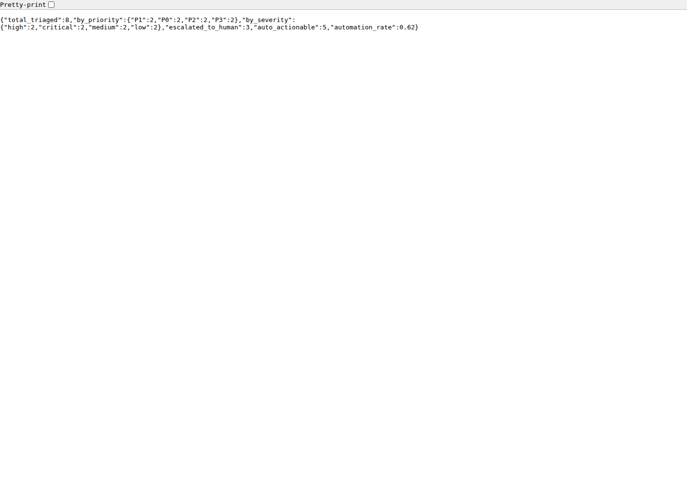
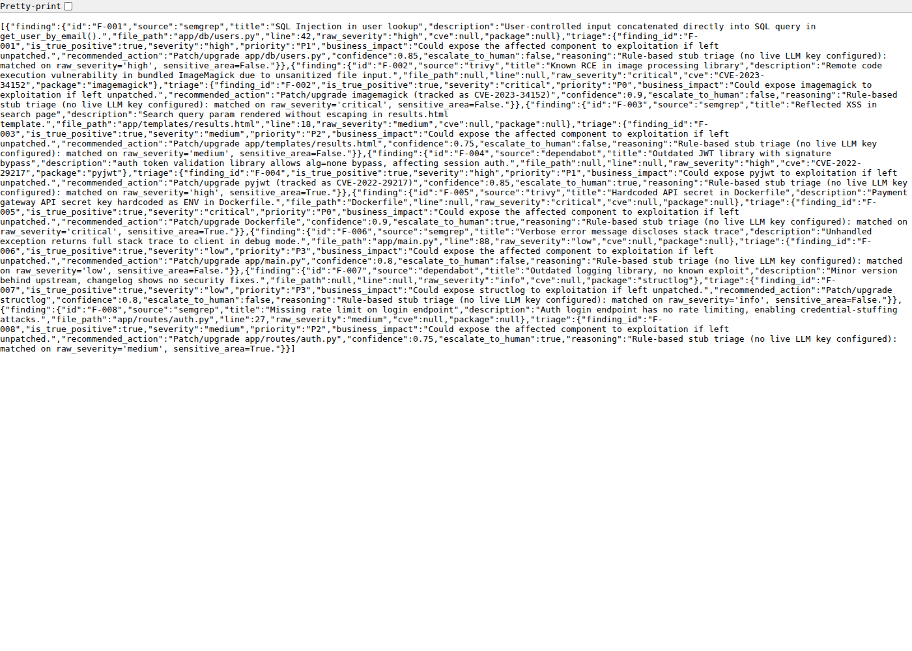
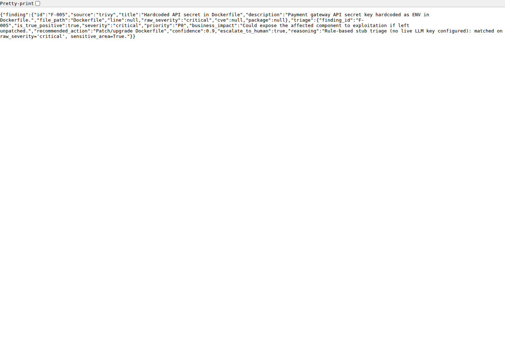

# Vulnerability Triage Agent

A Python REST API that automates first-pass triage of vulnerability scanner
findings (SAST/DAST/dependency-scanner style) using an LLM agent, with a
schema-validated structured output contract and a human-escalation guardrail
for sensitive findings (auth, payments, secrets).

## Screenshots

**Interactive API docs (Swagger UI)**


**Aggregated risk report**


**All findings with triage results**


**Single finding detail**


## Why this exists

Manual triage of scanner output (Semgrep, Trivy, Dependabot, etc.) is slow
and repetitive: someone has to read every finding, decide if it's real,
decide how bad it is, and decide what to do about it. This project automates
that first pass end-to-end while keeping a human in the loop for judgment
calls it isn't confident about — not for busywork.

## Architecture

```
Scanner output (JSON) --> POST /findings/ingest
                              |
                              v
                        TriageAgent.triage()
                    (Claude API call, structured
                     JSON output, schema-validated)
                              |
                              v
                  TriageResult (severity, priority,
                  business impact, recommended action,
                  confidence, escalate_to_human)
                              |
                              v
              GET /findings   GET /report (aggregated risk view)
```

- **`app/models.py`** — Pydantic schemas for input findings and the
  structured triage output contract.
- **`app/triage_agent.py`** — the agent harness. Calls Claude with a system
  prompt constraining it to return only schema-shaped JSON. Falls back to a
  deterministic rule-based triage engine (identical interface/output
  contract) when no `ANTHROPIC_API_KEY` is set, so the API and eval harness
  can be exercised in CI without live credentials.
- **`app/main.py`** — FastAPI REST endpoints: ingest, triage one/all, list,
  and an aggregated `/report` endpoint for stakeholders.
- **`tests/test_api.py`** — the eval harness: validates every output is
  schema-correct, measures triage agreement against a hand-labeled ground
  truth set, and asserts sensitive findings (auth/payment/secrets) always
  escalate to a human rather than being auto-actioned.

## Running it

```bash
pip install -r requirements.txt
uvicorn app.main:app --reload
```

Set `ANTHROPIC_API_KEY` to use the live Claude-backed agent; without it, the
API runs on the deterministic stub agent (same schema, same endpoints).

## Example

```bash
curl -X POST localhost:8000/findings/ingest -d @sample_data/findings.json
curl -X POST localhost:8000/findings/triage-all
curl localhost:8000/report
```

## Eval results (deterministic stub agent, 8 sample findings)

```
Severity+Priority agreement vs. hand-labeled ground truth: 8/8 (100%)
Escalation-decision agreement: 8/8 (100%)
Automation rate (findings resolved without human review): 62%
```

Run `pytest tests/ -v -s` to reproduce.
